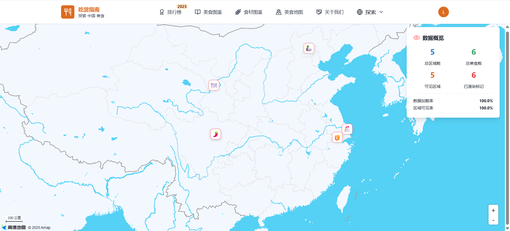

# 🍽️ FoodieGuideFront

欢迎来到 **FoodieGuideFront** 项目的主页！  
这是一个美食指南前端项目，旨在帮助用户轻松发现附近的美食、浏览餐厅详情、分享点评，提升你的美食探索体验。

---

## 📦 项目简介

FoodieGuideFront 是基于现代 Web 技术（如 React、TypeScript 等）开发的美食推荐平台前端。  
它为用户提供了便捷的餐厅搜索、菜品浏览、用户评价和个性化推荐等功能。

---

## 🚀 项目功能

- 🔍 **餐厅搜索与筛选**  
  支持按位置、菜系、评分等条件快速查找餐厅。
- 🏬 **餐厅详情展示**  
  查看餐厅图片、菜单、营业时间、联系方式和地图位置。
- 💬 **用户评价与互动**  
  发布点评、点赞评论、收藏餐厅，参与美食互动社区。
- 🧑‍🍳 **个性化推荐**  
  根据用户偏好智能推荐附近热门餐厅。
- 📱 **响应式设计**  
  适配桌面与移动端，随时随地发现美食。

---

## 🌈 技术栈

- ⚛️ **React**：构建高效动态用户界面
- 🧑‍💻 **TypeScript**：静态类型增强项目可维护性
- 🎨 **Styled Components / CSS Modules**：美观且可扩展的样式方案
- 🔗 **Axios / Fetch**：高效与后端 API 通信
- 🗺️ **地图 SDK（如高德/百度）**：实现餐厅定位与地图展示

---

## 📷 项目截图



---

## 🔧 快速开始

1. 克隆项目代码  
   ```bash
   git clone https://github.com/LiuXuBestehen/FoodieGuideFront.git
   ```
2. 安装依赖  
   ```bash
   npm install
   ```
3. 启动开发环境  
   ```bash
   npm start
   ```
4. 打开浏览器访问  
   ```
   http://localhost:3000
   ```

---

## 🛠️ 环境要求

- Node.js >= 16.x
- 推荐使用 npm >= 8.x

---

## 📝 贡献指南

欢迎任何形式的贡献！  

---

## 📮 联系方式 & 社区

- 提交 Issue 或 PR 寻求帮助或提出建议
- 邮箱：981098693@qq.com
- 更多交流请加入项目讨论区

---

## 📄 许可证

本项目采用 MIT License 进行开源。

---

> 让每一道菜都成为生活中的美好回忆  
> **FoodieGuideFront —— 你的专属美食指南助手 🍔🍜🍕**
